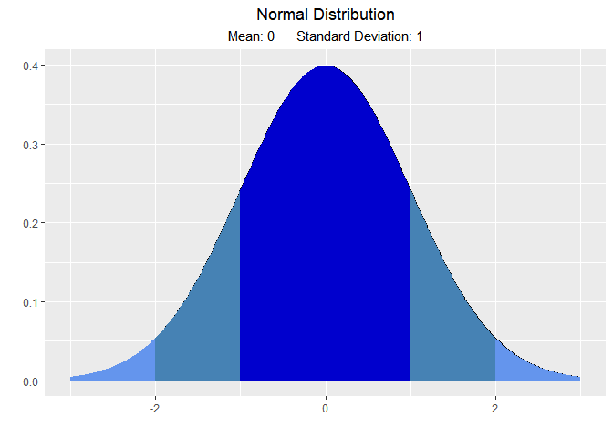
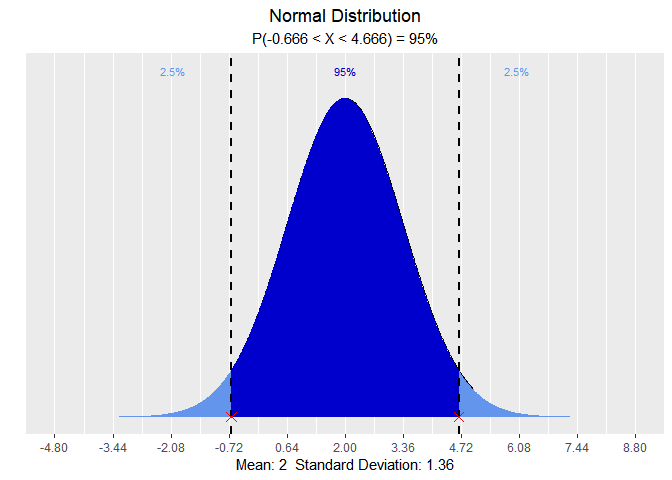
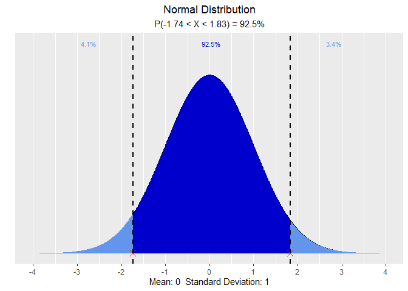

<!-- README.md is generated from README.Rmd. Please edit that file -->

# vistributions

> Visualize probability distributions

<!-- badges: start -->

[](https://cran.r-project.org/package=vistributions)
[](https://cran.r-project.org/web/checks/check_results_vistributions.html)
[](https://github.com/rsquaredacademy/vistributions/actions)
[](https://codecov.io/github/rsquaredacademy/vistributions?branch=master)
[](https://CRAN.R-project.org/package=vistributions)
[](https://lifecycle.r-lib.org/articles/stages.html)
[](https://cran.r-project.org/package=vistributions)
<!-- badges: end -->

## Installation

``` r
# Install release version from CRAN
install.packages("vistributions")

# Install development version from GitHub
# install.packages("devtools")
devtools::install_github("rsquaredacademy/vistributions")
```

## Articles

-   [Explore
    Distributions](https://vistributions.rsquaredacademy.com/articles/introduction-to-vistributions.html)

## Usage

### Normal Distribution

``` r
# visualize normal distribution
vdist_normal_plot()
```



``` r
# visualize quantiles out of given probability
vdist_normal_perc(0.95, mean = 2, sd = 1.36, type = 'both')
```



``` r
# visualize probability from a given quantile
vdist_normal_prob(c(-1.74, 1.83), type = 'both')
```



## Getting Help

If you encounter a bug, please file a minimal reproducible example using
[reprex](https://reprex.tidyverse.org/index.html) on github. For
questions and clarifications, use
[StackOverflow](https://stackoverflow.com/).
