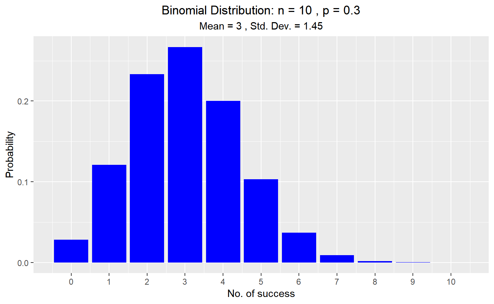

<!-- README.md is generated from README.Rmd. Please edit that file -->

# vistributions

> Visualize probability
distributions

[](https://cran.r-project.org/package=vistributions)
[](https://travis-ci.org/rsquaredacademy/vistributions)
[](https://ci.appveyor.com/project/aravindhebbali/vistributions)
[](https://codecov.io/github/rsquaredacademy/vistributions?branch=master)


## Installation

You can install the development version of vistributions from
[GitHub](https://github.com) with:

``` r
install.packages("devtools")
devtools::install_github("rsquaredacademy/vdistributions")
```

## Usage

### Binomial Distribution

``` r
vdist_binom_plot(n = 10, p = 0.3, lib = 'ggplot2')
```



## Community Guidelines

Please note that the ‘vistributions’ project is released with a
[Contributor Code of Conduct](CODE_OF_CONDUCT.md). By contributing to
this project, you agree to abide by its terms.
